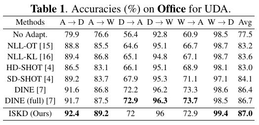
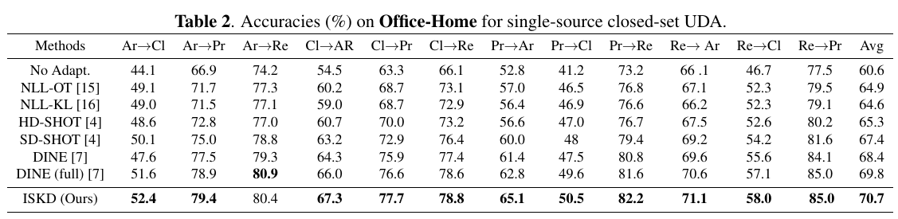
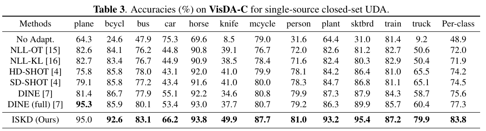

# Information Selection-based Domain Adaptation from Black-box Predictors
This repository is the anonymous Pytorch implementation of the ISKD method.

## Main Idea
Unsupervised domain adaptation aims to address the problem of under labeling by performing knowledge transfer between labeled source domains and unlabeled target domains.
Despite impressive progress, learning methods that rely on raw data and raw source model parameters all have the potential for privacy leakage in real life.
In recent studies, the source model is set up as a black-box model with only inputs and outputs available, and knowledge distillation is introduced to fit the target model.
However, the results of knowledge distillation are affected by confusion-prone instances and incorrect predictions of teacher networks, so we propose an Information Selection-based Knowledge Distillation (ISKD) strategy to perform more efficient distillation. 
We first perform semantic-level optimization of the source model output information through the association of categories and then filter the instance-level information with constructed confidence scores. In addition to this, the introduction of the self-distillation mechanism further improves the model performance. We conduct experiments on three benchmark datasets and obtain state-of-the-art performance.
## The State-of-the-art Performance

## Installation and Requirements

### Installation

- Python 3.7
- PyTorch 1.8.1
- Numpy 1.22.0

### Prepare datasets and pre-trained models
Download **Sketchy Extended** and **TU-Berlin** dataset by following [SEM-PCYC](https://github.com/AnjanDutta/sem-pcyc).

### Training & Testing
##### OFFICE-HOME 
     ./run_oh.sh
      
##### VISDA-C
     ./run_v.sh
 
